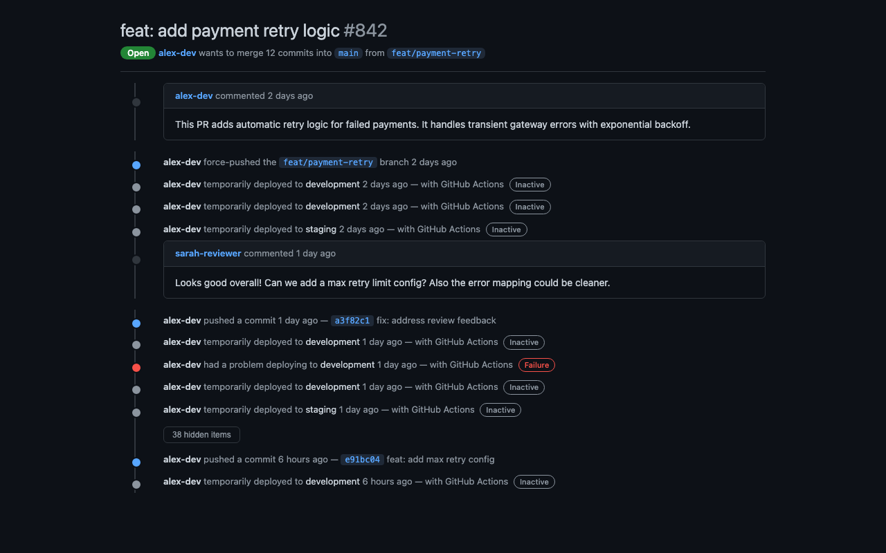
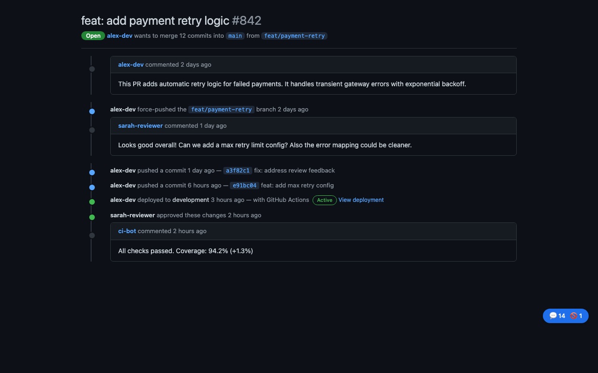
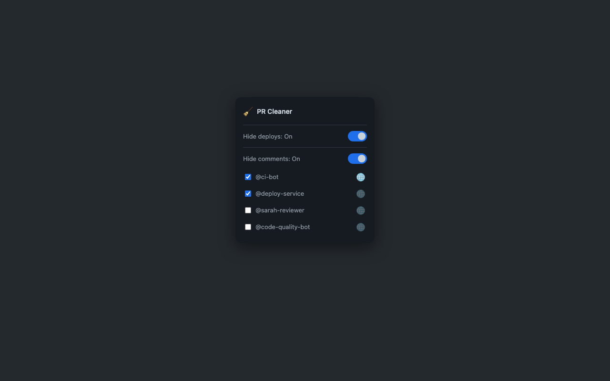

# GitHub PR Cleaner

[](https://chromewebstore.google.com/detail/github-pr-cleaner/ahinoefocpjljohjiklakaeaefaomgkm)
[](https://chromewebstore.google.com/detail/github-pr-cleaner/ahinoefocpjljohjiklakaeaefaomgkm)
[](https://chromewebstore.google.com/detail/github-pr-cleaner/ahinoefocpjljohjiklakaeaefaomgkm)
[](LICENSE)

Chrome extension that cleans up noisy GitHub pull request timelines by hiding deployment items, silencing specific users, and removing items matching custom text patterns.

## Screenshots

| Before | After |
|--------|-------|
|  |  |



## Features

- **Hide deploy noise** — automatically hides timeline items matching deployment patterns
- **Silence users** — hide all timeline activity from specific users (comments, reviews, inline comments)
- **Hide by text** — hide timeline items whose text matches a user-managed list of patterns; each entry is a case-insensitive substring or, optionally, a regular expression
- **Per-PR or global** — mute a user or text pattern on just one PR, or globally across all PRs
- **Interactive chip** — floating `💬 N 🚫 N 🔍 N` counter on the page; click to see a full breakdown
- **SPA-aware** — works with GitHub's client-side navigation (Turbo), including navigating from the PR list into a PR
- **Popup controls** — toggle features on/off, manage silenced users and text patterns with per-PR and global options
- **Reload prompt** — when you un-mute a user or remove a pattern, the popup offers to reload the page to restore hidden content

## Install

### From the Chrome Web Store (recommended)

[](https://chromewebstore.google.com/detail/github-pr-cleaner/ahinoefocpjljohjiklakaeaefaomgkm)

### From source

1. Clone the repo and install dependencies:

```sh
pnpm install
pnpm run build
```

2. Open `chrome://extensions` in Chrome
3. Enable **Developer mode**
4. Click **Load unpacked** and select the `dist/` folder

## Development

```sh
pnpm run build          # Bundle to dist/
pnpm run watch          # Bundle + watch for changes
pnpm run lint           # Lint with oxlint
pnpm run lint:fix       # Lint and auto-fix
pnpm run format         # Format with oxfmt
pnpm run format:check   # Check formatting
```

## Tech stack

- **TypeScript**
- **Rolldown** — bundler
- **oxlint** — linter
- **oxfmt** — formatter
- **loglevel** — logging

## Project structure

```
src/
  content/
    index.ts          Content script entry point and orchestration
    deploy.ts         Deploy item hiding logic
    comments.ts       User scraping and comment hiding
    text.ts           Custom text pattern matching and hiding
    chip.ts           Floating chip with popover
  background/
    index.ts          Message router + SPA navigation injection
    cleaner.ts        Deploy toggle state management
    comments.ts       Comment hiding state (global + per-PR)
    text.ts           Text pattern state (global + per-PR)
    types.ts          Shared types for message handlers
  popup.html          Extension popup UI
  popup.ts            Popup logic (toggles, lists, reload banner)
  constants.ts        Shared selectors, regexes, storage keys, and types
  logger.ts           Logging utility
  manifest.json       Chrome extension manifest (v3)
```

## License

[ISC](LICENSE)
